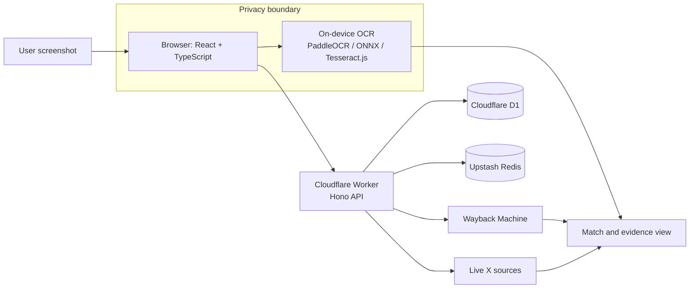

# Receipts

> Drop a screenshot of an X post and find its archived original — with on-device OCR, Wayback lookup, and live-X triangulation.

<p>
  
  
  
  
</p>
<p>
  
  
  
  
  
  
</p>
<p>
  
  
  
  
  <a href="https://github.com/aditya-c7/receipts/actions/workflows/ci.yml"></a>
</p>

## Why it is interesting

- **Private by design:** OCR runs in the browser, so receipt images and extracted text do not need to leave the device.
- **Archive-first search:** A Snowflake timestamp inferred from a post URL narrows Wayback queries to the relevant capture window.
- **Evidence triangulation:** Archive results, live-X data, and extracted screenshot text are compared to surface the strongest match.

## Tech stack

| Area | Choice | Version | Purpose |
| --- | --- | --- | --- |
| Frontend | React, Vite, Tailwind CSS, TypeScript | 18, 5, 4, 5 | Fast, typed browser experience |
| Edge API | Hono on Cloudflare Workers | 4 | Lightweight edge endpoints and integrations |
| Data | Cloudflare D1, Upstash Redis | — | Persistent lookup data and rate-limit/cache support |
| OCR | PaddleOCR, ONNX Runtime, Tesseract.js | v5, 1.19, 5 | On-device text extraction with fallback engines |
| Quality | Vitest, Playwright, GitHub Actions | — | Unit tests, end-to-end coverage, and continuous integration |

## Architecture



Receipt images and OCR output remain in the browser; the edge layer receives lookup inputs only.

## How it works

1. Upload or paste a screenshot containing an X post.
2. Run OCR locally to identify post text, usernames, timestamps, and URLs.
3. Query archive and live sources through the Worker, then rank candidate matches.
4. Review the matched post alongside its supporting archive and live evidence.

## Privacy

| Data | Handling |
| --- | --- |
| Screenshot image | Processed locally in the browser |
| OCR text | Kept client-side for matching unless explicitly used in a lookup |
| External queries | Sent only to the sources required for archive/live verification |

## Quick start

**Requirements:** Node.js 20+, pnpm 9+, and a Cloudflare account for Worker/D1 bindings.

```bash
git clone https://github.com/aditya-c7/receipts.git
cd receipts
pnpm install
cp .env.example .env
cp .dev.vars.example .dev.vars
pnpm dev
```

On Windows, use `host-local.cmd` to start the local hosting flow configured by the project.

## Scripts

| Command | Description |
| --- | --- |
| `pnpm dev` | Start the Vite development server |
| `pnpm build` | Create a production build |
| `pnpm preview` | Preview the production build locally |
| `pnpm lint` | Run ESLint |
| `pnpm test` | Run Vitest tests |
| `pnpm test:e2e` | Run Playwright end-to-end tests |

## Live testing

Run the local app with valid environment bindings, upload a representative screenshot, and verify that the returned evidence links resolve before relying on a match.

## Credits and license

Built by [Aditya C](https://github.com/aditya-c7). Licensed under the [MIT License](LICENSE).
