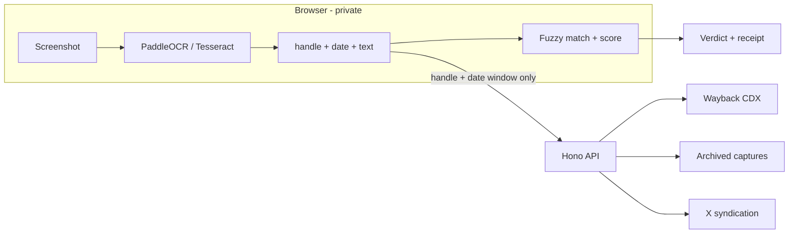

# Receipts - "Did they really post that?"


Drop in a screenshot of an X/Twitter post. In ~10 seconds you get
**`Archived original found - 96% match`** (or an honest
**`No archive match - that does not mean it is not real`**), a word-level
diff, the original post link, and a shareable receipt.

## How it works



1. OCR runs **on-device** (PaddleOCR PP-OCRv5 first, Tesseract fallback).
   Pixels never leave the device.
2. Only the **handle + date window** goes to the API, which searches the
   Wayback Machine by Snowflake ID time buckets.
3. The best candidate's public tweet ID is cross-checked against X itself.
   Archive + live agree - `Verified against X + archive`.
4. Receipts are opt-in and server-recomputed (unforgeable).

## Privacy

Screenshots never upload. Post text uploads only when you create a receipt.
The app shows the exact JSON of every request. A missing archive proves
nothing - the app never calls anything fake.

## Run it free

| Piece | Free tier |
|---|---|
| App + API | Cloudflare Workers |
| Cache + rate limits | Upstash Redis |
| Receipt store | Cloudflare D1 |
| OCR | Self-hosted WASM, no keys |
| Archive | Wayback public APIs |

## Quickstart

```powershell
$env:PATH = "$env:USERPROFILE\.npm-global;$env:PATH"
npm install --global pnpm@9.12.0
cd D:\Workspace\finder
pnpm install
copy .dev.vars.example .dev.vars   # fill in values, never commit
pnpm dev:all                        # web :5173 + api :8787
```

Or double-click `host-local.cmd` - builds and hosts app + API from
`http://127.0.0.1:8787` (keep the server window open).

| Command | Purpose |
|---|---|
| `pnpm typecheck` / `lint` / `test` | Must all pass before every commit |
| `pnpm e2e` | Playwright suite (real in-browser OCR) |
| `pnpm build` | First-load budget: 150 kB gz |
| `pnpm deploy` | Build + dry-run Worker deploy |

## Verdicts

`MATCH_STRONG` / `MATCH_LIKELY` / `MATCH_PARTIAL` -
`POST_EXISTS_TEXT_UNREADABLE` - `NO_MATCH` (not proof of fakery) -
`INSUFFICIENT_INPUT` - `ARCHIVE_UNAVAILABLE` - `UNSUPPORTED_PLATFORM`.

## Test it live

`$env:LIVE='1'; pnpm vitest run tests/unit/wayback/cdx.live.test.ts`

## Credits

Powered by the Internet Archive's Wayback Machine (not affiliated) -
[donate](https://archive.org/donate). OCR: PaddleOCR (Apache-2.0),
Tesseract (Apache-2.0). UI follows the shadcn pattern (MIT).

MIT licensed - see [LICENSE](LICENSE). Agent rules: [AGENTS.md](AGENTS.md).
Progress log: `docs/PROGRESS.md`.
